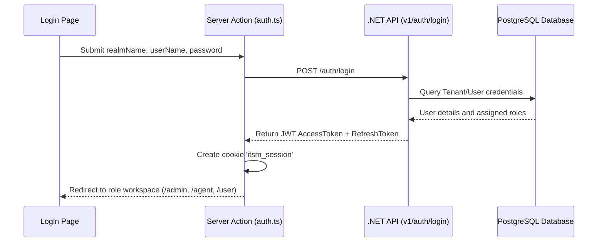
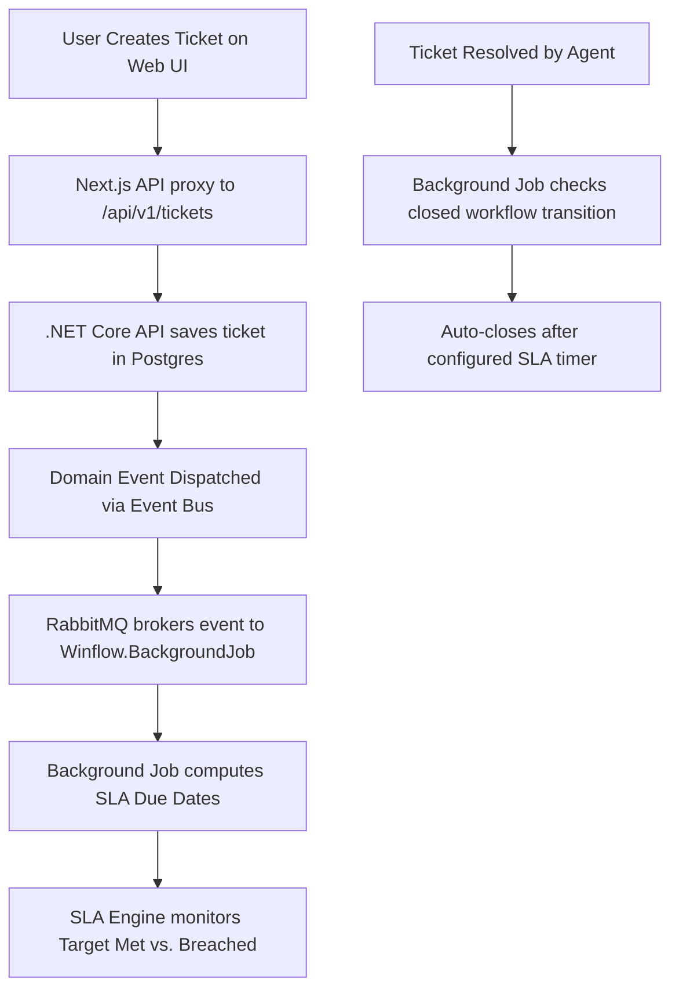
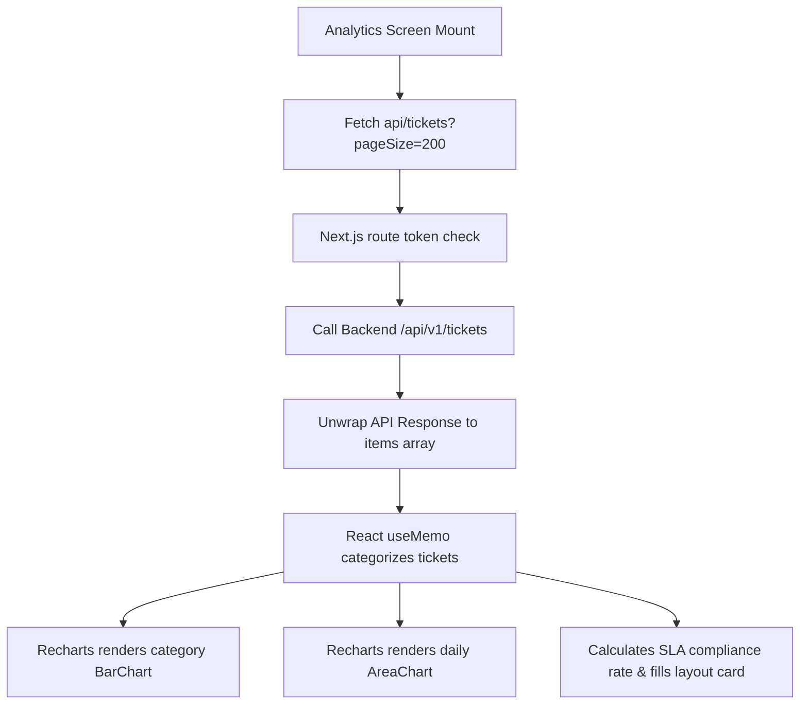

# EvolveITSM - Enterprise IT Service Management

EvolveITSM is a next-generation, multi-tenant Enterprise IT Service Management platform designed to optimize operational efficiency, streamline incident workflows, and provide deep business intelligence. 

The application is built on a decoupled architecture comprising a high-performance **Next.js 16 (App Router) frontend** and a robust **.NET 8 Clean Architecture backend** backed by PostgreSQL, RabbitMQ, and background processing workers.

---

## 🌟 Key Features

*   **Multi-Tenant Isolation (Realms):** Logins are partitioned by organization realms, mapping users securely to their tenant-specific databases and settings.
*   **Role-Based Workspaces:**
    *   **Admin Dashboard:** High-level metrics, system integrity boards, quick shortcuts, master data management, and operational analytics.
    *   **Agent Dashboard:** Personal work queues, active incident boards, status history controls, and assignment logs.
    *   **User Portal:** Simplified ticket logging, attachment uploading, and self-service incident tracking.
*   **Real-Time SLA Engine:** Tracks ticket creation against target policies (`FirstResponseDueAt`, `ResolutionDueAt`) and visualizes breaches dynamically.
*   **Business Intelligence Analytics:** Rich data charts displaying:
    *   **Incident Type Volume:** Weekly comparison of category metrics.
    *   **Resolution Efficiency:** Daily ticket closures.
    *   **Top Performers:** Active ranking leaderboard based on real resolved ticket counts per agent.
    *   **SLA Health Widget:** Compliance rates, met vs. breached ratios, and progress gauges.
*   **Dynamic Localization (i18n):** Full support for English, Dutch, French, German, Italian, and Spanish. Changes propagate dynamically through the client, session, and backend request headers.

---

## 🛠️ Technology Stack

### Frontend Architecture
*   **Core Framework:** Next.js 16.2 (Turbopack, App Router) & React 19
*   **Styling & Motion:** Tailwind CSS v4 & Framer Motion (for fluid micro-interactions and animations)
*   **Data Visualization:** Recharts v3 (Area, Bar, and Gauge layouts)
*   **Icons:** Lucide React
*   **State Management:** React Context API (Language Preference & System Notifications/Toasts)

### Backend Architecture (.NET 8 Clean Architecture)
*   **Hosting Layer:** ASP.NET Core Web API (Minimal APIs & Swagger Documentation)
*   **Application Layer:** MediatR (CQRS Pattern) & FluentValidation
*   **Domain Core:** DDD entities, value objects, and domain events
*   **Persistence:** EF Core with PostgreSQL (Code-First Migrations)
*   **Messaging & Events:** RabbitMQ Event Bus
*   **Background Processing:** .NET Background Worker (State-machine workflow automation and SLA monitors)

---

## 📂 Project Structure

### 1. Frontend Workspace (`/Users/abhiraljain/ITSM`)
```
ITSM/
├── app/                        # Next.js App Router root
│   ├── (dashboard)/            # Dashboard layout containing shared navigation and links
│   │   ├── admin/              # Admin-specific pages (Analytics, Master Data, Members, Settings)
│   │   ├── agent/              # Agent-specific pages (Incidents queue, Assigned boards)
│   │   ├── user/               # User-specific portal (Incident registration, status)
│   │   ├── layout.tsx          # Master sidebar and responsive navigation layout
│   │   └── loading.tsx         # Global loading screen fallback
│   ├── actions/                # Server Actions (Auth login/logout actions)
│   ├── api/                    # Next.js API Routes (Session managers and proxies)
│   │   ├── auth/               # Session storage & realm handlers
│   │   └── tickets/            # Ticket route proxies to .NET REST API
│   ├── login/                  # Premium Glassmorphic Login portal
│   ├── layout.tsx              # Root HTML wrapper with providers
│   └── page.tsx                # Context-aware entry route
├── components/                 # Shared UI component library
│   └── ui/                     
│       ├── Badge.tsx           # Tailwind styled status badges
│       ├── Button.tsx          # Custom loaders and state-handling buttons
│       ├── Card.tsx            # Rounded premium border containers
│       ├── LanguageSelector.tsx# Popover language select with dynamic cookies
│       └── tickets/            # Specialized ticket lists, rows, and detail cards
├── context/                    # Shared context providers
│   ├── LanguageContext.tsx     # Dynamics translation states
│   └── ToastContext.tsx        # Toast alert manager
└── lib/                        # Core utilities and client libraries
    ├── api-utils.ts            # Server-side API fetches and cookie tokens
    ├── client-api.ts           # Axios-like client wrapper with silent token-refresh
    ├── client-session.ts       # Session read hooks for client components
    ├── external-auth.ts        # Connects Server Actions directly to .NET auth endpoints
    ├── i18n/                   # Translation configurations and locale loaders
    └── session.ts              # Server-side encrypted cookies session manager
```

### 2. Backend Workspace (`/Users/abhiraljain/Desktop/WinFlow-API`)
```
WinFlow-API/
├── Winflow.API/                # Web API project (Endpoints, Controllers, Swagger configurations)
├── Winflow.Application/        # MediatR Queries, Commands, Validation rules, mapping models
├── Winflow.BackgroundJob/      # Workflow Automations, SLA trackers, background timers
├── Winflow.Domain/             # Clean Domain core (Entities: Ticket, Category, User, Tenant)
├── Winflow.Identity/           # ASP.NET Identity, token generation (JWT, Refresh Tokens)
├── Winflow.Infrastructure/     # EventBus (RabbitMQ), Mailers, External services
├── Winflow.Localization/       # Culture dictionaries and localization services
├── Winflow.Persistence/        # DbContext, Migrations, PostgreSQL mapping configurations
└── Winflow.Shared/             # Common models, shared constants, utility extensions
```

---

## 🔄 Core Flows & Pipelines

### 🔑 Authentication Pipeline


### 🎫 Ticket SLA & Automation Pipeline


### 📊 Analytics & BI Binding Pipeline


---

## 🚀 Getting Started

### Prerequisites
*   Node.js 18+
*   .NET SDK 8.0+
*   PostgreSQL Database
*   RabbitMQ Instance

### 1. Setup Backend Infrastructure
You can run the supporting systems using Docker Compose. Navigate to the backend directory and launch docker containers:
```bash
cd /Users/abhiraljain/Desktop/WinFlow-API
docker-compose up -d
```
*This starts PostgreSQL on port `5432` and RabbitMQ on ports `5672`/`15672`.*

### 2. Configure & Run Backend Services
Apply the Entity Framework migrations to update the database schema and seed the initial tenant data, then run the API and Background services:
```bash
# Apply EF migrations
cd Winflow.Persistence
dotnet ef database update --startup-project ../Winflow.API

# Run the API server
cd ../Winflow.API
dotnet run

# Run the Background Automation service
cd ../Winflow.BackgroundJob
dotnet run
```
*The API is now running locally on `https://localhost:5001`.*

### 3. Run the Frontend Workspace
Navigate to the frontend workspace, install dependencies, and start the development server:
```bash
cd /Users/abhiraljain/ITSM
npm install
npm run dev
```
*Open [http://localhost:3000](http://localhost:3000) to view the application.*

---

## 🛡️ Coding Guidelines & Rules

1.  **Token Refreshing:** Make all REST calls through the configured client API functions (`apiGet`, `apiPost` etc.) located in [client-api.ts](file:///Users/abhiraljain/ITSM/lib/client-api.ts). It intercepts `401 Unauthorized` states and silently updates keys, preventing routing loops.
2.  **API Page Limits:** The backend validates query sizes strictly. Never request page sizes larger than `200` for listing routes, otherwise the backend will reject with a `400 Bad Request` validation error.
3.  **Layout Balance:** Avoid adding hardcoded heights (`h-full` etc.) to right-hand content panels in grid sections (such as analytics cards) unless the elements are stacked in a column to prevent empty whitespace blocks.
4.  **Tailwind CSS:** When writing layouts, use standard utility styles that follow established glassmorphism design parameters (e.g. `bg-card/40 backdrop-blur-xl rounded-[2.5rem]`).
